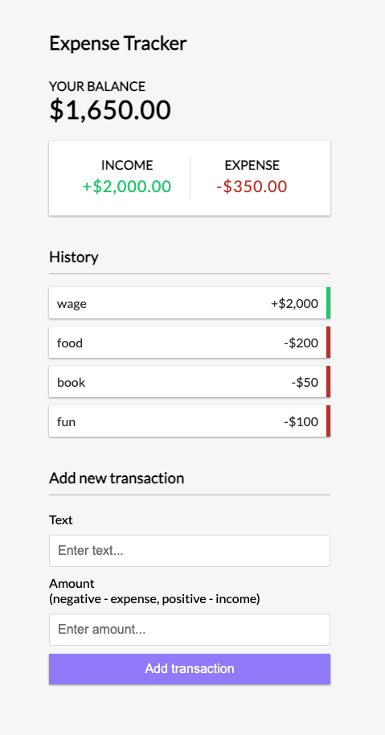

# Expense-Tracker

An expense-tracker webapp build with React, Context, NodeJS, MongoDB, JavaScript

## Project Status

The project is a small project that I build to practice my MERN stack skills. It include CRUD operations.

The project is live at: https://phih-expense-tracker.herokuapp.com/

## Installation

1. Clone this repo. You will need node and npm installed on your machine
2. Open the project in your IDE and run the following command on your command line:
```
npm install
cd client
npm install
```
3. Create a config file with:
```
"mongoURI": your mongodb uri,
```
4. Then you can run the below command to run the project:
```
npm run dev
```

## Screen Shots

Main Screen


